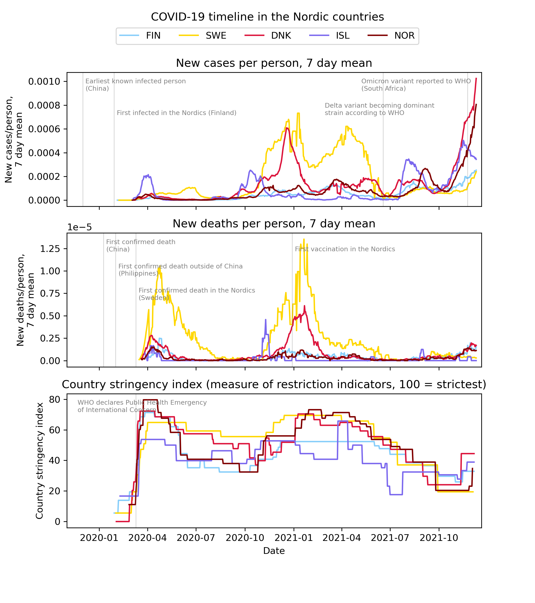

COVID-19-project
================

This repo contains analysis of COVID-19 data from the Nordic countries
(Finland, Sweden, Denmark, Iceland and Norway). The code is written in
Python using Jupyter notebook.

Example figure below showing the seven day rolling mean of new cases and
deaths as well as the country stringency index were plotted against
time. The country stringency index is a measure of nine indicators such
as school/workplace closures and travel bans. Chosen key events are also
plotted as vertical lines.

See the jupyter notebook for the full analysis and report
[here](https://github.com/kriputest/covid-19-project/blob/main/covid-19.ipynb).
Figures are found in the [output
folder](https://github.com/kriputest/covid-19-project/tree/main/output).

